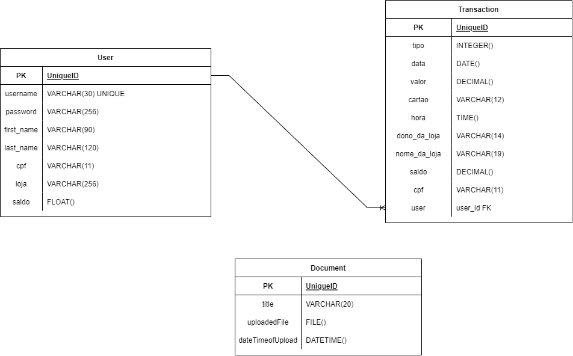

# Importador de Transações por arquivo - Teste Técnico S2

## Sumário

- [Importador de Transações por arquivo - Teste Técnico S2](#importador-de-transações-por-arquivo---teste-técnico-s2)
  - [Sumário](#sumário)
  - [Resumo](#resumo)
  - [1. Desenvolvedor](#1-desenvolvedor)
  - [2. Diagrama de entidades e relacionamentos](#2-diagrama-de-entidades-e-relacionamentos)
  - [3. Preparativos](#3-preparativos)
    - [3.1. Instalando Dependências](#31-instalando-dependências)
    - [3.2. Variáveis de ambiente](#32-variáveis-de-ambiente)
      - [3.2.1 Definindo banco de dados a ser usado](#321-definindo-banco-de-dados-a-ser-usado)
        - [3.2.1.1 Banco recomendado para testes (sqlite3)](#3211-banco-recomendado-para-testes-sqlite3)
        - [3.2.1.2 Banco recomendado para produção (PostgreSQL)](#3212-banco-recomendado-para-produção-postgresql)
    - [3.3. Entrando no ambiente virtual](#33-entrando-no-ambiente-virtual)
    - [3.4. Instale as dependências](#34-instale-as-dependências)
    - [3.5. Execute as migrações para realizar a persistência de dados](#35-execute-as-migrações-para-realizar-a-persistência-de-dados)
    - [3.6. Rodando a API localmente](#36-rodando-a-api-localmente)
  - [4. Rotas](#4-rotas)
    - [Documentação da API](#documentação-da-api)
  - [5. Histórico de desenvolvimento](#5-histórico-de-desenvolvimento)
    - [5.1. Objetivo](#51-objetivo)
    - [5.2. Decisões de desenvolvimento](#52-decisões-de-desenvolvimento)
      - [5.2.1. Ordem de desenvolvimento](#521-ordem-de-desenvolvimento)
      - [5.2.2. Models, Serializers e View](#522-models-serializers-e-view)
      - [5.2.3. Utils e Media](#523-utils-e-media)
      - [5.2.4. Configurações extras](#524-configurações-extras)
        - [5.2.4.1 Configurar para que apenas super usuários possam importar arquivos](#5241-configurar-para-que-apenas-super-usuários-possam-importar-arquivos)
      - [5.2.5. Pontos não cobertos](#525-pontos-não-cobertos)
  - [6. Agradecimentos](#6-agradecimentos)
- [Shalom!](#shalom)

---

## Resumo

[ Voltar ao topo ](#sumário)

Essa aplicação foi desenvolvida para o teste técnico realizado na sprint 2 do módulo 6 para a Kenzie Academy Brasil no intuito de revisar e treinar testes técnicos para o mercado de trabalho.

O objetivo da aplicação é permitir que, por meio de um arquivo, transações realizadas por clientes sejam cadastradas em um banco de dados, para isso, desenvolvi uma API que recebe esse arquivo, faz a formatação dos dados linha por linha e cadastra dentro do banco de dados.

Tecnologias usadas nesse projeto:

- [Python](https://www.python.org)
- [Django](https://www.djangoproject.com)
- [Django Rest-Framework](https://www.django-rest-framework.org)
- [drf-spectacular](https://drf-spectacular.readthedocs.io/en/latest/)
- [ipdb](https://pypi.org/project/ipdb/)
- [Pillow](https://pypi.org/project/Pillow/)
- [Black](https://pypi.org/project/black/)

## 1. Desenvolvedor

[ Voltar ao topo ](#sumário)

> - [Bruno Tibério Santinoni de Oliveira](https://brunotiberio.vercel.app)

---

## 2. Diagrama de entidades e relacionamentos

[ Voltar ao topo ](#sumário)



---

## 3. Preparativos

[ Voltar ao topo ](#sumário)

### 3.1. Instalando Dependências

Clone o projeto em sua máquina local e instale o ambiente virtual VENV:

```shell
python -m venv venv
```

### 3.2. Variáveis de ambiente

[ Voltar ao topo ](#sumário)

Crie um arquivo **.env** no diretório raiz do projeto, copiando o exemplo do **.env.example**:

```shell
cp .env.example .env
```

No **.env** defina a variável **SECRET_KEY** com o valor de uma secret_key (você pode usar um site gerador de secret_key ou escrever qualquer coisa) para que as requisições funcionem.

#### 3.2.1 Definindo banco de dados a ser usado

##### 3.2.1.1 Banco recomendado para testes (sqlite3)

[ Voltar ao topo ](#sumário)

Não é necessário atribuir suas variáveis de ambiente, apenas configurar o campo **TESTE** do **.env**, inserindo algum tipo de informação a sua escolha (recomendo "Teste"), assim, após rodar as migrações, um banco de dados sqlite3 será criado em seu workspace para usar como testes

##### 3.2.1.2 Banco recomendado para produção (PostgreSQL)

[ Voltar ao topo ](#sumário)

Atribua suas variáveis de ambiente às credenciais do seu PostgreSQL à um database da sua escolha e apague qualquer informação no campo **TESTE** do **.env**, assim, após rodar as migrações, seu banco de dados PostgreSQL poderá ser usado para persistir seus dados em produção.

### 3.3. Entrando no ambiente virtual

[ Voltar ao topo ](#sumário)

Entre no ambiente virtual com o comando:

**Windows**

```shell
source venv/Scripts/activate # terminal BASH
```

ou

```shell
.\venv\Scripts\activate # terminal powershell
```

**Linux**

```shell
source venv/bin/activate
```

### 3.4. Instale as dependências

[ Voltar ao topo ](#sumário)

Dependências necessárias para rodar o projeto:

```shell
pip install -r requirements.txt
```

### 3.5. Execute as migrações para realizar a persistência de dados

[ Voltar ao topo ](#sumário)

**Windows**

```shell
.\manage.py migrate # terminal BASH
```

ou

```shell
python manage.py migrate # terminal powershell
```

**Linux**

```shell
./manage.py migrate
```

### 3.6. Rodando a API localmente

[ Voltar ao topo ](#sumário)

Com o ambiente virtual ativado, primeiramente crie um **Super Usuário** no shell para ter acesso ao sistema administrativo por meio do comando:

**OBS: Caso queira criar um novo Super usuário, pode ser utilizado o mesmo comando**

```shell
./manage.py createsuperuser
```

Preencha os dados solicitados no shell.

Agora rode a aplicação usando o comando:

```shell
./manage.py runserver
```

Aguarde o processamento e sua aplicação já estará disponível para uso em http://localhost:8000/.

---

## 4. Rotas

[ Voltar ao topo ](#sumário)

### Documentação da API

**Observação: Rode a aplicação como descrito no passo 3**

O consumo pode ser feito tanto pelo Admin do Djando (links logo abaixo) e pelo Insonmia. Caso queira usar o workspace pronto do insonmia, use esse link: (coloque o workspace para download)

É possível acessar à documentação completa para poder utilizar a API.

- [Home e Documentação](http://localhost:8000/)

Nessa mesma documentação é possível adquirir informações sobre os requests, chaves necessárias do request e outras informações importantes para a utilização da API.

Apps desenvolvidos e aplicados:

- Core
- Transactions
- Users

As demais rotas para serem usadas no navegador são:

- [Upload de Arquivos para importação das transações](http://localhost:8000/api/import/)
- [Criar uma ou listar todas as transações do sistema](http://localhost:8000/api/transaction/)
- [Criar novos usuários e listar todos os usuários e suas transações](http://localhost:8000/api/user/)
- [Acessar o painel administrativo (para mudanças ou adições mais simples)](http://localhost:8000/admin/) -> Apenas o super usuário pode acessar esse painel.

Como as transações de um único usuário:

Basta usar a baseURL e passar o CPF do usuário cadastrado no sistema no parâmetro do link:

Exemplo:

```
http://localhost:8000/api/user/23270298056/
```

23270298056 CPF do usuário José da Costa

Retorno do exemplo:

```
[
{
"id": "8b9ff2ba-d3e2-44a4-a791-6c633a930091",
"cpf": "23270298056",
"dono_da_loja": "JOSÉ COSTA",
"nome_da_loja": "MERCEARIA 3 IRMÃOS",
"tipo": 3,
"valor": "602.00",
"cartao": "6777****1313",
"data": "2019-03-01",
"hora": "17:27:12",
"saldo": "-602.00",
"user": "58cde101-002a-442d-a3af-84881dde0ec0"
},
{
"id": "b2d36e0f-bac0-4735-89f9-19b1c90a9389",
"cpf": "23270298056",
"dono_da_loja": "JOSÉ COSTA",
"nome_da_loja": "MERCEARIA 3 IRMÃOS",
"tipo": 2,
"valor": "102.00",
"cartao": "8473****1231",
"data": "2019-03-01",
"hora": "23:12:33",
"saldo": "-704.00",
"user": "58cde101-002a-442d-a3af-84881dde0ec0"
},
{
"id": "ae72831f-18b7-45fd-8a1c-e11f81a479b0",
"cpf": "23270298056",
"dono_da_loja": "JOSÉ COSTA",
"nome_da_loja": "MERCEARIA 3 IRMÃOS",
"tipo": 3,
"valor": "6102.00",
"cartao": "6777****1313",
"data": "2019-03-01",
"hora": "17:27:12",
"saldo": "-6806.00",
"user": "58cde101-002a-442d-a3af-84881dde0ec0"
},
{
"id": "927759fb-1262-4b50-bb81-3e98b712ff62",
"cpf": "23270298056",
"dono_da_loja": "JOSÉ COSTA",
"nome_da_loja": "MERCEARIA 3 IRMÃOS",
"tipo": 3,
"valor": "103.00",
"cartao": "6777****1313",
"data": "2019-03-01",
"hora": "17:27:12",
"saldo": "-6909.00",
"user": "58cde101-002a-442d-a3af-84881dde0ec0"
},
{
"id": "e0b17713-ec38-4fd7-b6df-a9b50b8b714f",
"cpf": "23270298056",
"dono_da_loja": "JOSÉ COSTA",
"nome_da_loja": "MERCEARIA 3 IRMÃOS",
"tipo": 2,
"valor": "109.00",
"cartao": "8723****9987",
"data": "2019-03-01",
"hora": "12:33:33",
"saldo": "-7018.00",
"user": "58cde101-002a-442d-a3af-84881dde0ec0"
},
{
"id": "9879a404-6d5b-4ac8-896d-146748bd5553",
"cpf": "23270298056",
"dono_da_loja": "JOSÉ COSTA",
"nome_da_loja": "MERCEARIA 3 IRMÃOS",
"tipo": 2,
"valor": "5.00",
"cartao": "7677****8778",
"data": "2019-03-01",
"hora": "14:18:08",
"saldo": "-7023.00",
"user": "58cde101-002a-442d-a3af-84881dde0ec0"
}
]
```

Observe que o saldo é atualizado de acordo com o tipo de transação e o valor

---

## 5. Histórico de desenvolvimento

[ Voltar ao topo ](#sumário)

### 5.1. Objetivo

[ Voltar ao topo ](#sumário)

O Objetivo principal dessa aplicação é a validação dos meus conhecimentos nos seguintes tópicos:

- Python;
- Solucionar como fazer um envio de um arquivo em um Banco de dados;
- Parsear um arquivo;
- Utilizar Frameworks ou bibliotecas (Opcional)

O arquivo usado no exemplo se encontra aqui: https://github.com/Kenzie-Academy-Brasil-Developers/desafio-backend-m6/blob/main/CNAB.txt

Outras informações importantes, sobre o tipo de transação e os dados do parse se encontram aqui: https://github.com/Kenzie-Academy-Brasil-Developers/desafio-backend-m6

### 5.2. Decisões de desenvolvimento

[ Voltar ao topo ](#sumário)

#### 5.2.1. Ordem de desenvolvimento

[ Voltar ao topo ](#sumário)

1. Inicialmente, decidi por começar pela análise do teste proposto, com isso, pude observar e pesquisar quais eram as tecnologias, frameworks e libs que poderiam ser usadas no desenvolvimento.
2. Por questões de boas práticas, decidi inicialmente sobrescrever o AbstractUser, pois caso fosse necessário, eu já poderia usa-lo.
3. Depois, trabalhei a lógica do upload, para que assim pudesse ser recebido o arquivo dentro do banco de dados por meio de um input.
4. Posteriormente, fiz a lógica de parsear e inserir os dados parseados nas entidades que criei.
5. Por fim, fiz os demais fix necessários do código e a documentação da API

#### 5.2.2. Models, Serializers e View

[ Voltar ao topo ](#sumário)

Foram criados, no total, 3 models:

- Core: Onde é feita toda a lógica de upload e parse do arquivo recebido, cadastrando os dados para as demais entidades;
- Transactions: Onde são listadas os dados das transações importados em Core ou cadastradas. Além disso, é possível criar uma transação individual por meio de uma requisição POST;
- Users: Aqui é possível listar os usuários cadastrados pela importação ou individualmente. Apesar de não ser necessário a utilização na aplicação, desenvolvi o Login desses usuários para caso eu queira escalonar a aplicação no futuro;

É importante destacar que apesar não ser solicitado algum tipo de proteção de rotas, ainda assim, tomei a liberdade de criar uma permissão que pode ser usado em alguma rota para bloquear alguma ação de um usuário.

#### 5.2.3. Utils e Media

[ Voltar ao topo ](#sumário)

Nessa arquitetura, há duas pastas importantes:

- Media: Onde ficam armazenados os arquivos que foram "upados" pelo usuário;
- Utils: Onde ficam alguns utilitários que podem ser usados globalmente pela aplicação:
  - Mixins: Ali está o "SerializerByMethodMixin" que faz o mapeamento do tipo de requisição, aplicando o serializer adequado para isso;
  - Permissions: Há uma permissão, que verifica se o usuário está autenticado (e seu token disponibilizado) e se é super usuário (é possível ser usado na rota de importação, fazendo com que apenas o super usuário possa importar o arquivo, desde que ele esteja logado). Para saber como adicionar, veja a seção "Configurações extras";
- Services: Há duas funções que podem ser usadas globalmente:
  - user_get_or_created: função usada para pesquisar se o usuário já existe na base de dados.
    - Caso usuário não exista: cria o usuário e o retorna
    - Caso usuário exista: retorna Falso. Esse returno é usado dentro do restante da lógica do app Core para definir como será feito a totalização do saldo das transações do usuário.
  - import_transactions_from_file: recebe os dados do arquivo importado e cria as transações, de acordo como a model Transactions solicita e retorna a importação realizada (não todas, mas a importação atual do arquivo).

#### 5.2.4. Configurações extras

[ Voltar ao topo ](#sumário)

##### 5.2.4.1 Configurar para que apenas super usuários possam importar arquivos

[ Voltar ao topo ](#sumário)

Caso queira adicionar a permissão para que, apenas o super usuário consiga fazer a importação do arquivo com os dados, basta copiar o exemplo abaixo e colar dentro do APP Core/view:

**Coloque esses imports**

```
from utils.permissions import ImportPermissionsAdminAuthToken
from rest_framework.authentication import TokenAuthentication
```

**Sobrescreva a view atual por essa**

```
class UploadView(SerializerByMethodMixin, generics.ListCreateAPIView):
queryset = Document.objects.all()
serializer_map = {
"GET": UploadSerializer,
"POST": UploadSerializer,
}

    authentication_classes = [TokenAuthentication]
    permission_classes = [ImportPermissionsAdminAuthToken]
```

Agora, para fazer a importação, é obrigatório que o usuário esteja **logado** e seja um **super usuário**

#### 5.2.5. Pontos não cobertos

[ Voltar ao topo ](#sumário)

Não consegui cobrir da listagem das transações por loja, retornando o saldo final. Ainda assim, decidi por fazer de outra maneira que ficou mais efetivo

- Coloquei dentro da model User o saldo, iniciando por padrão 0.00, fazendo com que esse saldo seja o atual do usuário
  - Importante: No cadastro não é obrigatório passar o saldo, porém, caso um usuário seja cadastrado e já possua um saldo inicial (pessoa que abre uma conta e já quer fazer um depósito inicial) a possibilidade também existe.
- Quando o arquivo é importado, primeiramente é feito a verificação se o usuário já existe ou não, caso não exista, o saldo será igual ao valor debitado/creditado inicialmente, caso exista, o saldo será recalculado, baseado nas transações anteriores e assim debitado/creditado do saldo atual, que está na model.
- A listagem é feita diretamente pelo usuário ao invés da loja, retornando o saldo total daquele usuário
  - É possível retornar todas as transações de todos os usuários com o saldo de cada transação
  - Também é possivel retornar todos os usuários com todas as suas transações e o saldo daquele usuário
  - Pode-se retornar um usuário específico por seu CPF, retornando todas as transações dele e o saldo atual
    - A decisão pelo CPF foi feita pois, como no ID é usado um UUID, ficaria complicado para um usuário com pouco conhecimento obter esse dado, então o CPF era o outro registro que difere um usuário do outro.

Após finalizar o projeto, acredito que se a lógica explicada acima fosse aplicada em uma entidade chamada Loja (e os dados da Loja fossem cadastrados com o arquivo importado, fazendo um 1:N entre User e Loja) seria possível fazer um "GET" do saldo por loja, porém, devido ao tempo, decidi não fazer e entregar uma solução alternativa que pudesse ser apreciada pelos avaliadores, mas isso serviu como uma experiência para estudar formas ainda mais produtivas de resolver esse problema e ver que tenho total condição de desenvolver essa feature, por isso, estou aberto a feedbacks que possam me mostrar alguns caminhos para chegar a esse resultado.

---

## 6. Agradecimentos

[ Voltar ao topo ](#sumário)

Quero agradecer por essa oportunidade de poder fazer o teste técnico e espero poder ter conseguido cumprir com boa parte daquilo que foi solicitado

# Shalom!

[ Voltar ao topo ](#sumário)
